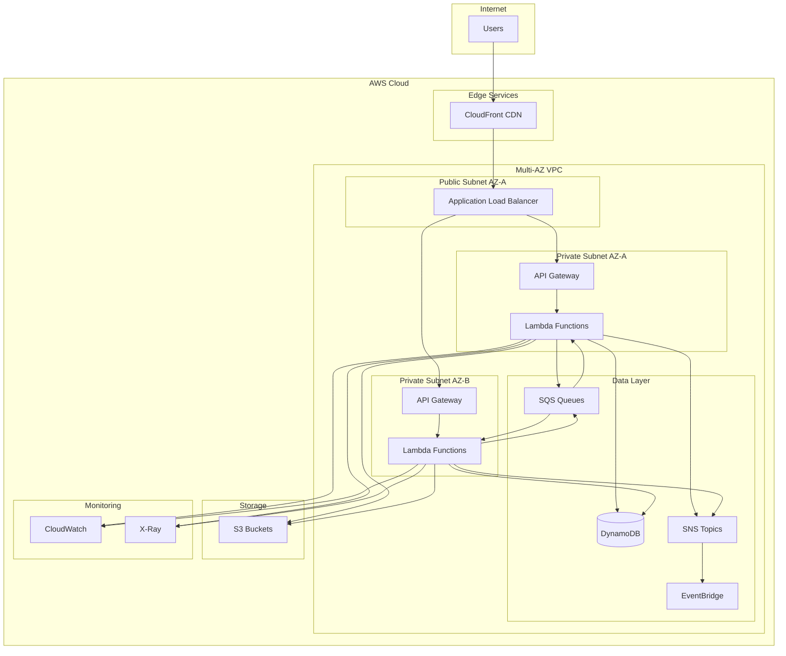

# 1. Arquitetura e Automação em Nuvem (AWS/Azure)

## 1.1 Arquitetura Event-Driven Altamente Escalável

### Visão Geral
Esta arquitetura implementa um sistema web orientado a eventos usando serviços AWS nativos, priorizando escalabilidade, resiliência e segurança.

### Componentes Principais

#### Frontend e API
- **Amazon CloudFront** - CDN global para redução de latência
- **API Gateway** - Ponto de entrada seguro com throttling e cache
- **AWS Lambda** - Funções serverless para processamento

#### Processamento de Eventos
- **Amazon SQS** - Filas para processamento assíncrono
- **Amazon SNS** - Pub/sub para distribuição de eventos
- **Amazon EventBridge** - Event routing avançado

#### Armazenamento
- **DynamoDB** - Banco NoSQL com auto-scaling
- **S3** - Object storage para assets e backups

#### Segurança e Monitoramento
- **AWS IAM** - Controle de acesso granular
- **VPC** - Isolamento de rede
- **CloudWatch** - Logs e métricas
- **AWS X-Ray** - Distributed tracing

### Diagrama de Arquitetura



### Considerações de Segurança

#### IAM (Identity and Access Management)
```json
{
  "Version": "2012-10-17",
  "Statement": [
    {
      "Effect": "Allow",
      "Principal": {
        "Service": "lambda.amazonaws.com"
      },
      "Action": "sts:AssumeRole"
    }
  ]
}
```

#### VPC Security Groups
- **API Gateway SG**: Apenas HTTPS (443) de CloudFront
- **Lambda SG**: Apenas comunicação com DynamoDB e S3
- **DynamoDB**: Apenas acesso de Lambda functions

#### Encryption
- **At Rest**: DynamoDB encryption, S3 SSE-KMS
- **In Transit**: TLS 1.2+ em todas as comunicações
- **Secrets**: AWS Secrets Manager para credenciais

### Alta Escalabilidade

#### Auto Scaling
- **Lambda**: Concorrência reservada + provisioned concurrency
- **DynamoDB**: On-demand scaling ou auto-scaling configurado
- **API Gateway**: Throttling configurável por cliente

#### Performance Optimization
```python
# Lambda configuration example
{
    "FunctionName": "ProcessEventFunction",
    "Runtime": "python3.9",
    "MemorySize": 1024,
    "Timeout": 30,
    "ReservedConcurrencyLimit": 100,
    "ProvisionedConcurrencyConfig": {
        "ProvisionedConcurrencyLimit": 10
    }
}
```

### Recuperação de Desastres

#### Multi-AZ Deployment
- **API Gateway**: Deploy em múltiplas AZs
- **Lambda**: Execução automática em AZs disponíveis  
- **DynamoDB**: Global Tables para replicação cross-region

#### Backup Strategy
```yaml
BackupStrategy:
  DynamoDB:
    PointInTimeRecovery: enabled
    BackupRetention: 35 days
  S3:
    Versioning: enabled
    CrossRegionReplication: us-east-1 -> us-west-2
  Lambda:
    CodeBackup: S3 with versioning
```

#### RTO/RPO Targets
- **RTO**: < 15 minutos (failover automático)
- **RPO**: < 5 minutos (continuous backup)

## 1.2 Estratégias Multi-Cloud (AWS/Azure)

### Consistência Cross-Cloud

#### Terraform Modules Padronizados
```hcl
# modules/kubernetes-cluster/main.tf
variable "cloud_provider" {
  description = "Cloud provider (aws|azure)"
  type        = string
}

module "eks_cluster" {
  source = "./aws-eks"
  count  = var.cloud_provider == "aws" ? 1 : 0
  # ... configurações AWS
}

module "aks_cluster" {
  source = "./azure-aks"
  count  = var.cloud_provider == "azure" ? 1 : 0
  # ... configurações Azure
}
```

#### Configuration Management
```yaml
# config/production.yaml
clouds:
  aws:
    region: us-east-1
    resources:
      compute: eks
      storage: s3
      database: dynamodb
  azure:
    region: eastus
    resources:
      compute: aks
      storage: blob
      database: cosmosdb

networking:
  vpc_cidr: "10.0.0.0/16"
  private_subnets: ["10.0.1.0/24", "10.0.2.0/24"]
  public_subnets: ["10.0.101.0/24", "10.0.102.0/24"]
```

### Rastreabilidade da Infraestrutura

#### GitOps Workflow
```yaml
# .github/workflows/multi-cloud-deploy.yml
name: Multi-Cloud Infrastructure Deploy
on:
  push:
    branches: [main]
    paths: ['terraform/**']

jobs:
  plan:
    runs-on: ubuntu-latest
    strategy:
      matrix:
        provider: [aws, azure]
    steps:
      - uses: actions/checkout@v3
      - name: Terraform Plan
        run: |
          cd terraform/${{ matrix.provider }}
          terraform plan -out=tfplan
      - name: Save Plan
        uses: actions/upload-artifact@v3
        with:
          name: tfplan-${{ matrix.provider }}
          path: terraform/${{ matrix.provider }}/tfplan
```

#### State Management
```hcl
# terraform/aws/backend.tf
terraform {
  backend "s3" {
    bucket         = "myorg-terraform-state-aws"
    key            = "infrastructure/terraform.tfstate"
    region         = "us-east-1"
    encrypt        = true
    dynamodb_table = "terraform-state-lock"
  }
}

# terraform/azure/backend.tf
terraform {
  backend "azurerm" {
    resource_group_name  = "tfstate-rg"
    storage_account_name = "myorgtfstateazure"
    container_name       = "tfstate"
    key                  = "infrastructure/terraform.tfstate"
  }
}
```

### Segurança Multi-Cloud

#### Centralized Identity Management
```yaml
# identity-federation.yaml
AWSIdentityProvider:
  Type: AWS::IAM::SAMLProvider
  Properties:
    Name: AzureADProvider
    SAMLMetadataDocument: !Ref AzureADMetadata

AzureServicePrincipal:
  Type: Microsoft.AAD/servicePrincipals
  Properties:
    appId: !Ref AWSConnectorAppId
    federatedCredentials:
      - issuer: https://token.actions.githubusercontent.com
        audiences: ["sts.amazonaws.com"]
```

## 1.3 Integração RBAC, ABAC e OIDC

### RBAC (Role-Based Access Control)

#### AWS Implementation
```json
{
  "Version": "2012-10-17",
  "Statement": [
    {
      "Effect": "Allow",
      "Principal": {
        "Federated": "arn:aws:iam::ACCOUNT:oidc-provider/token.actions.githubusercontent.com"
      },
      "Action": "sts:AssumeRoleWithWebIdentity",
      "Condition": {
        "StringEquals": {
          "token.actions.githubusercontent.com:aud": "sts.amazonaws.com",
          "token.actions.githubusercontent.com:sub": "repo:org/repo:ref:refs/heads/main"
        }
      }
    }
  ]
}
```

#### Azure Implementation
```yaml
# azure-rbac.yaml
apiVersion: rbac.authorization.k8s.io/v1
kind: Role
metadata:
  namespace: production
  name: deployment-manager
rules:
- apiGroups: ["apps"]
  resources: ["deployments"]
  verbs: ["get", "list", "create", "update", "patch"]
- apiGroups: [""]
  resources: ["pods", "services"]
  verbs: ["get", "list"]
```

### ABAC (Attribute-Based Access Control)

#### Policy Engine
```json
{
  "policies": [
    {
      "id": "data-access-policy",
      "effect": "Allow",
      "subjects": {
        "attributes": {
          "department": "engineering",
          "clearance_level": ">=3"
        }
      },
      "resources": {
        "type": "database",
        "classification": "confidential"
      },
      "conditions": {
        "time_range": "09:00-17:00",
        "location": "corporate_network"
      }
    }
  ]
}
```

### OIDC Integration

#### GitHub Actions OIDC
```yaml
# .github/workflows/deploy.yml
permissions:
  id-token: write
  contents: read

steps:
  - name: Configure AWS credentials
    uses: aws-actions/configure-aws-credentials@v2
    with:
      role-to-assume: arn:aws:iam::ACCOUNT:role/GitHubActionsRole
      aws-region: us-east-1

  - name: Azure Login
    uses: azure/login@v1
    with:
      client-id: ${{ secrets.AZURE_CLIENT_ID }}
      tenant-id: ${{ secrets.AZURE_TENANT_ID }}
      subscription-id: ${{ secrets.AZURE_SUBSCRIPTION_ID }}
```

#### Keycloak Integration
```yaml
# keycloak-config.yaml
apiVersion: v1
kind: ConfigMap
metadata:
  name: keycloak-config
data:
  keycloak.json: |
    {
      "realm": "multi-cloud",
      "auth-server-url": "https://auth.company.com/auth",
      "ssl-required": "external",
      "resource": "multi-cloud-app",
      "credentials": {
        "secret": "CLIENT_SECRET"
      }
    }
```

## Resumo Executivo

Esta arquitetura fornece:

✅ **Escalabilidade**: Auto-scaling em todos os componentes  
✅ **Resiliência**: Multi-AZ deployment com failover automático  
✅ **Segurança**: Encryption at rest/transit, IAM granular  
✅ **Observabilidade**: Logging, monitoring e tracing completos  
✅ **Multi-Cloud**: Estratégias para AWS e Azure  
✅ **Governance**: RBAC, ABAC e OIDC integrados  

**Próximos Passos**: Implementação dos módulos Terraform na Seção 2.
