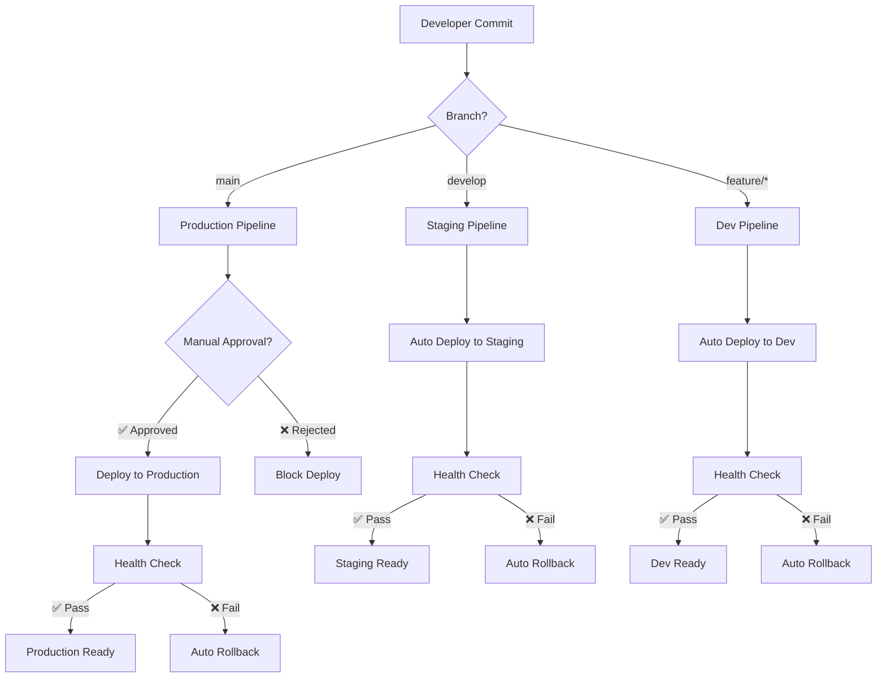

# Diagramas de Arquitetura GitOps

## 1. Fluxo de Decisão GitOps Simplificado



## 2. Arquitetura de Componentes

```
┌─────────────────────────────────────────────────────────────────────────────┐
│                           KUBERNETES CLUSTER (AKS)                         │
├─────────────────────────────────────────────────────────────────────────────┤
│                                                                             │
│  ┌─────────────────┐    ┌─────────────────┐    ┌─────────────────┐        │
│  │   ARGOCD NS     │    │   PRODUCTION    │    │    STAGING      │        │
│  │                 │    │      NS         │    │      NS         │        │
│  │ ┌─────────────┐ │    │ ┌─────────────┐ │    │ ┌─────────────┐ │        │
│  │ │ArgoCD Server│ │    │ │  App Pod 1  │ │    │ │  App Pod 1  │ │        │
│  │ │             │ │    │ │  App Pod 2  │ │    │ │  App Pod 2  │ │        │
│  │ └─────────────┘ │    │ │  Service    │ │    │ │  Service    │ │        │
│  │                 │    │ │  Ingress    │ │    │ │  Ingress    │ │        │
│  │ ┌─────────────┐ │    │ └─────────────┘ │    │ └─────────────┘ │        │
│  │ │ArgoCD Repo  │ │    └─────────────────┘    └─────────────────┘        │
│  │ │Server       │ │                                                       │
│  │ └─────────────┘ │    ┌─────────────────┐    ┌─────────────────┐        │
│  │                 │    │   MONITORING    │    │   KUBE-SYSTEM   │        │
│  │ ┌─────────────┐ │    │      NS         │    │      NS         │        │
│  │ │ArgoCD       │ │    │ ┌─────────────┐ │    │ ┌─────────────┐ │        │
│  │ │Application  │ │    │ │ Prometheus  │ │    │ │External     │ │        │
│  │ │Controller   │ │    │ │ Grafana     │ │    │ │Secrets      │ │        │
│  │ └─────────────┘ │    │ │ AlertMgr    │ │    │ │Operator     │ │        │
│  └─────────────────┘    │ └─────────────┘ │    │ └─────────────┘ │        │
│                         └─────────────────┘    └─────────────────┘        │
│                                                                             │
├─────────────────────────────────────────────────────────────────────────────┤
│                          EXTERNAL INTEGRATIONS                             │
├─────────────────────────────────────────────────────────────────────────────┤
│                                                                             │
│  ┌─────────────┐    ┌─────────────┐    ┌─────────────┐    ┌─────────────┐  │
│  │   GITHUB    │    │AZURE KEYVAULT│   │  SLACK/TEAMS│    │    OIDC     │  │
│  │             │    │              │    │             │    │  (Azure AD) │  │
│  │ Repository  │◄──►│   Secrets    │◄──►│Notifications│◄──►│    SSO      │  │
│  │ Webhooks    │    │ Certificates │    │  Alerts     │    │   Groups    │  │
│  └─────────────┘    └─────────────┘    └─────────────┘    └─────────────┘  │
└─────────────────────────────────────────────────────────────────────────────┘
```

## 3. Fluxo de Deploy com Gates de Segurança

```
┌─────────────┐
│ Git Commit  │
└──────┬──────┘
       │
       ▼
┌─────────────┐
│   Webhook   │
│  Triggered  │
└──────┬──────┘
       │
       ▼
┌─────────────┐      🚫 GATE 1: Syntax Check
│ ArgoCD      │ ────────────────────────────┐
│ Detects     │                             │
│ Changes     │                             ▼
└──────┬──────┘                      ┌─────────────┐
       │                             │   FAIL:     │
       ▼                             │ Notify Team │
┌─────────────┐      🚫 GATE 2: RBAC │ Block Deploy│
│ Validate    │ ────────────────────►└─────────────┘
│ Permissions │                             ▲
└──────┬──────┘                             │
       │                                    │
       ▼                                    │
┌─────────────┐      🚫 GATE 3: Environment │
│ Environment │ ────────────────────────────┤
│ Check       │                             │
└──────┬──────┘                             │
       │                                    │
       ▼                                    │
┌─────────────┐    ❓ DECISION POINT        │
│ Auto-Sync?  │                             │
└──┬────┬─────┘                             │
   │    │                                   │
   │    └─────────┐                         │
   ▼              ▼                         │
┌──────┐    ┌─────────────┐                 │
│ AUTO │    │   MANUAL    │                 │
│ SYNC │    │  APPROVAL   │                 │
└──┬───┘    └──────┬──────┘                 │
   │               │                        │
   │               ▼                        │
   │        ┌─────────────┐   🚫 REJECTED   │
   │        │ Approval    │ ────────────────┘
   │        │ Required?   │
   │        └──────┬──────┘
   │               │ ✅ APPROVED
   │               │
   └───────────────┼─────────────────┐
                   │                 │
                   ▼                 │
            ┌─────────────┐          │
            │ Apply K8s   │          │
            │ Manifests   │          │
            └──────┬──────┘          │
                   │                 │
                   ▼                 │
            ┌─────────────┐  🚫 GATE 4: Health Check
            │ Post-Deploy │ ─────────────────────────┘
            │ Validation  │
            └──────┬──────┘
                   │
                   ▼
            ┌─────────────┐
            │ ✅ SUCCESS  │
            │ Notify Team │
            └─────────────┘
```

## 4. RBAC e Controle de Acesso

```
                    ┌─────────────────────────────────────────┐
                    │            AZURE AD GROUPS             │
                    └─────────────────┬───────────────────────┘
                                      │
                    ┌─────────────────▼───────────────────────┐
                    │          OIDC INTEGRATION               │
                    │                                         │
                    │ devops-team    → role:admin             │
                    │ platform-team  → role:devops           │
                    │ dev-team       → role:developer         │
                    │ qa-team        → role:qa                │
                    └─────────────────┬───────────────────────┘
                                      │
    ┌─────────────────────────────────▼─────────────────────────────────┐
    │                        ARGOCD RBAC                                │
    ├─────────────────────────────────────────────────────────────────┤
    │                                                                 │
    │ ┌─────────────┐  ┌─────────────┐  ┌─────────────┐  ┌─────────────┐ │
    │ │    ADMIN    │  │   DEVOPS    │  │  DEVELOPER  │  │     QA      │ │
    │ │             │  │             │  │             │  │             │ │
    │ │ • All Apps  │  │ • Prod Apps │  │ • Dev Apps  │  │ • Stage Apps│ │
    │ │ • All Envs  │  │ • Stage     │  │ • Read Only │  │ • Read Only │ │
    │ │ • All Ops   │  │ • Read All  │  │ • Sync Dev  │  │ • Sync Stage│ │
    │ │             │  │             │  │             │  │             │ │
    │ └─────────────┘  └─────────────┘  └─────────────┘  └─────────────┘ │
    │                                                                 │
    └─────────────────────────────────────────────────────────────────┘
                                      │
                    ┌─────────────────▼───────────────────────┐
                    │         KUBERNETES RESOURCES            │
                    │                                         │
                    │ Production NS   → Manual Approval       │
                    │ Staging NS      → Auto Deploy           │
                    │ Dev NS          → Auto Deploy           │
                    │ Monitoring NS   → DevOps Only           │
                    └─────────────────────────────────────────┘
```

## 5. Integração com External Secrets

```
┌─────────────────────────────────────────────────────────────────────────┐
│                        SECRET MANAGEMENT FLOW                          │
└─────────────────────────────────────────────────────────────────────────┘

    ┌─────────────┐
    │ Azure       │
    │ Key Vault   │
    └──────┬──────┘
           │ 🔐 Secure Connection
           │    (Workload Identity)
           ▼
    ┌─────────────┐
    │ External    │
    │ Secrets     │
    │ Operator    │
    └──────┬──────┘
           │ 📋 Fetch & Sync
           ▼
    ┌─────────────┐      ┌─────────────┐      ┌─────────────┐
    │ K8s Secret  │      │ K8s Secret  │      │ K8s Secret  │
    │  (Prod)     │      │ (Staging)   │      │   (Dev)     │
    └──────┬──────┘      └──────┬──────┘      └──────┬──────┘
           │                    │                    │
           ▼                    ▼                    ▼
    ┌─────────────┐      ┌─────────────┐      ┌─────────────┐
    │Application  │      │Application  │      │Application  │
    │   Pods      │      │   Pods      │      │   Pods      │
    │  (Prod)     │      │ (Staging)   │      │   (Dev)     │
    └─────────────┘      └─────────────┘      └─────────────┘

🔄 ROTATION SCHEDULE:
• Database passwords: 30 days
• API keys: 60 days  
• Certificates: 90 days
• Service tokens: 7 days
```

## 6. Monitoramento e Observabilidade

```
┌─────────────────────────────────────────────────────────────────────────┐
│                     MONITORING STACK                                   │
├─────────────────────────────────────────────────────────────────────────┤
│                                                                         │
│  ┌─────────────┐    ┌─────────────┐    ┌─────────────┐                 │
│  │ PROMETHEUS  │───►│  GRAFANA    │───►│ ALERTMANAGER│                 │
│  │             │    │             │    │             │                 │
│  │ • Metrics   │    │ • Dashboard │    │ • Slack     │                 │
│  │ • ArgoCD    │    │ • ArgoCD    │    │ • PagerDuty │                 │
│  │ • K8s       │    │ • K8s       │    │ • Email     │                 │
│  │ • Apps      │    │ • Apps      │    │             │                 │
│  └─────────────┘    └─────────────┘    └─────────────┘                 │
│                                                                         │
├─────────────────────────────────────────────────────────────────────────┤
│                      KEY METRICS                                       │
├─────────────────────────────────────────────────────────────────────────┤
│                                                                         │
│ 📊 ArgoCD Metrics:                 📊 Application Metrics:             │
│ • Sync Status                      • Response Time                     │
│ • Sync Frequency                   • Error Rate                        │
│ • Health Status                    • Throughput                        │
│ • Repository Connectivity          • Resource Usage                    │
│                                                                         │
│ 📊 Kubernetes Metrics:             📊 Infrastructure Metrics:          │
│ • Pod Status                       • Node Health                       │
│ • Resource Usage                   • Network I/O                       │
│ • Events                           • Storage I/O                       │
│ • Ingress Traffic                  • API Server Latency               │
│                                                                         │
└─────────────────────────────────────────────────────────────────────────┘
```

## 7. Disaster Recovery e Backup

```
                ┌─────────────────────────────────────────┐
                │           BACKUP STRATEGY               │
                └─────────────────┬───────────────────────┘
                                  │
        ┌─────────────────────────┼─────────────────────────┐
        │                         │                         │
        ▼                         ▼                         ▼
┌─────────────┐          ┌─────────────┐          ┌─────────────┐
│   ETCD      │          │ PERSISTENT  │          │   CONFIG    │
│   BACKUP    │          │   VOLUMES   │          │   BACKUP    │
│             │          │             │          │             │
│ • Daily     │          │ • Snapshots │          │ • Git Repo  │
│ • Retention │          │ • Cross-AZ  │          │ • Manifests │
│ • 30 days   │          │ • 7 days    │          │ • Configs   │
└─────────────┘          └─────────────┘          └─────────────┘
        │                         │                         │
        └─────────────────────────┼─────────────────────────┘
                                  │
                ┌─────────────────▼───────────────────────┐
                │         RECOVERY PROCEDURES             │
                │                                         │
                │ 🔄 RTO: < 4 hours                      │
                │ 🔄 RPO: < 1 hour                       │
                │ 🔄 Multi-AZ deployment                 │
                │ 🔄 Automated failover                  │
                │ 🔄 Health checks every 30s             │
                └─────────────────────────────────────────┘
```

---

**Observações:**
- Todos os diagramas seguem padrões de arquitetura cloud-native
- Implementação baseada em melhores práticas GitOps
- Segurança integrada em todos os fluxos
- Automação com pontos de controle manual para produção
- Observabilidade completa do pipeline ao runtime
